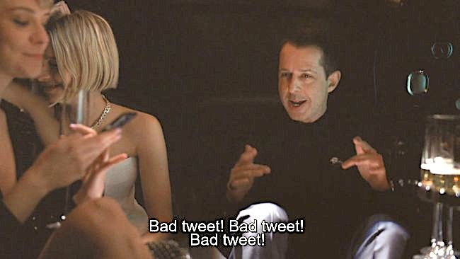
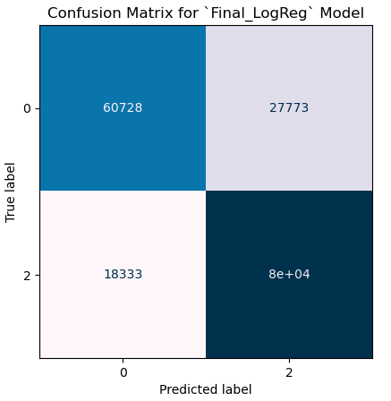

# Tweet Sentiment Analysis

**"Keeping Your Finger On The Pulse"**

**Author**: [Tristan Trechsel](mailto:tristantrechsel@gmail.com)

## Overview

I created a rudimentary sentiment classifier tool that analyzes recent tweets about a given topic (brand, celebrity, product, etc.) to give a real-time reading of public perception.

## Business Problem

For stakeholders with a brand to maintain and protect, awareness of public perception is critical. Having a timely indication of negative reactions can help these stakeholders to anticipate PR crises, and thus allow them to respond quickly and appropriately. Social media and machine learning together offer a revolutionary way to "take the temperature" of the public towards a given brand without opting for costly and protracted surveys or focus groups.


## Data

The data was collected from the 4 sources listed below. In total there were close to 3 million tweets, labeled as positive, negative, or neutral. After cleaning and cutting down, the final model was trained on 2 million of these tweets, all of either the positive or negative class.

[Airline Tweet Sentiments dataset](https://data.world/crowdflower/airline-twitter-sentiment)

[Apple Tweet Sentiment dataset](https://data.world/crowdflower/apple-twitter-sentiment)

[Sentiment 140 dataset](https://www.kaggle.com/datasets/kazanova/sentiment140/)

[Tweet 4 Sentiment Analysis dataset](http://www.t4sa.it)

## Processing & Modeling

To deal with this amount of data, I needed to use a cloud computing service. I used Amazon Sagemaker Studio, built on a jupyter lab interface, for the data cleaning, processing, modeling, and testing. I used Amazon's S3 service to host the raw data, which integrates easily with sagemaker.

I cleaned and combined the 4 data sources, eliminating duplicates and null values. I then used standard NLP techniques like tokenization, stopword removal, and case standardizing on the tweets. I applied a TF-IDF vectorizer and tested various combinations of hyperparameters with this, settling on using unigrams and bigrams, and a max of 75k features with the final model.

After iterating through several instances of Multinomial Naive Bayes, Logistic Regression, and Random Forest algorithms, I settled on Logistic Regression with only 2 classes as the most useful model. With a testing accuracy of over 75%, which held up when applied to the hidden validation data, I felt comfortable taking it into deployment phase. Below is the confusion matrix for this final model's performance on the validation data. Class 0 is negative sentiment, and 2 is positive. Our recall scores were 68.6% for negative and 81.3% for positive.



## Deployment
For our Mock Deployment, I had a little fun and let a few bitter rivals duke it out in the court of public opinion. For the full story, see the presentation. Below is a sample result from my model, showing Mark Zuckerberg narrowly being less hated than Elon Musk. 

I am continuing work on a web app for a more robust deployment, which will allow you, reader, to play around with this tool yourself.


## Limitations

This is a bootcamp student project, and not intended to be used in a true business environment. I want to clearly note several limitations here. These need to be addressed before I would feel comfortable standing by any results from this tool.

- I have not been able to properly integrate my sagemaker environment with github; the files in this repo have been downloaded from that instance and uploaded directly to this repo from my local machine.
- The ground truth of the model may be shaky. I am ultimately relying on the tweets I used to train being accurately classified, which I can not verify.
- The tweets used to train are as much as 10+ years old. I recognize that the language of twitter and social media evolves rapidly, and so subtle meanings that exist in new tweets analyzed by the model may be getting missed because of the age of the training data.
- The twitter API is now prohibitively expensive. I paid for the basic subscription to the API, which allows me to retrieve a max of 100 tweets per request, and limits me to 10k tweets a month. So this tool is only analyzing 100 tweets for a given topic, which is much too small a sample size to deem it representative of a larger audience.
- The model is only capable of analyzing english text. It does not recognize any other language, emojis, images, or videos that may be included with a tweet. Ideally, all of this information would be parsed and analyzed.

## Conclusions

I had a lot of fun making this and would welcome any feedback you may have! Please reach out on [linkedin](https://www.linkedin.com/in/trechsel/) if you'd like to chat.

## Repository Structure

```
┌── code # notebooks and transformers in here
│   ┌── Deployment.ipynb # Mock deployment for querying twitter API
│   ├── EDA_Cleaning.ipynb 
│   ├── Modeling.ipynb
│   ├── Preprocessing.ipynb
│   ├── final_model.pkl
│   ├── preprocess_tweet.pkl
│   └── vectorizer.pkl
├── images # saved charts and images for readme
├── .gitignore
├── README.md
├── Tweet_Sentiment_Analysis_Presentation.pdf
└── Tweet.app.py # streamlit app still in production
```
